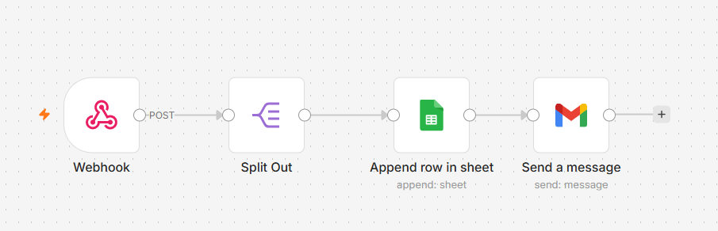

# Python Web Scraper & Automation

A Python-based web scraping and automation project that collects book titles and prices from Books to Scrape using Requests and BeautifulSoup.

The scraped data is sent from Python to an n8n webhook, where it is processed and automatically added to Google Sheets. After the data is added successfully, an email notification is sent using Gmail.

This project was built as a practical learning project while developing my skills in Python, Web Scraping, APIs, Webhooks, n8n, and AI Automation.
## 🚀 Features

- Scrapes book titles and prices using Python
- Uses Requests for HTTP requests
- Uses BeautifulSoup for HTML parsing
- Sends scraped data to an n8n webhook
- Processes data using n8n
- Splits scraped data into individual items
- Automatically adds data to Google Sheets
- Sends an email notification after processing
- Demonstrates Python + API + Automation integration
  ## 🔄 Automation Workflow

The project follows this workflow:

Python Web Scraper
↓
n8n Webhook
↓
Split Out
↓
Google Sheets
↓
Gmail

### 1. Python Web Scraper

Python sends a request to the Books to Scrape website and extracts book titles and prices using BeautifulSoup.

### 2. n8n Webhook

The scraped data is sent from Python to an n8n webhook using an HTTP POST request.

### 3. Split Out

The n8n Split Out node processes the received data and separates the individual book records.

### 4. Google Sheets

The processed book information is automatically added as rows in Google Sheets.

### 5. Gmail

After the data is processed, the workflow sends an email notification using Gmail.

## 🛠️ Technologies Used

- Python
- Requests
- BeautifulSoup
- n8n
- Webhooks
- Google Sheets
- Gmail
- Git
- GitHub

 ## 📸 Automation Workflow

